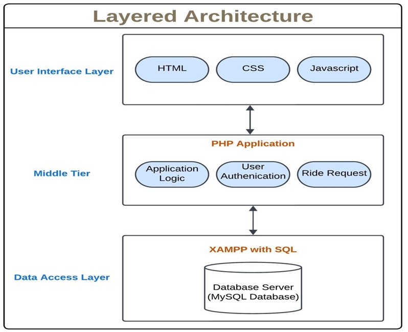

# RydeSync Carpooling Platform

## Project Overview
RydeSync is a web-based carpooling platform designed to connect commuters for shared rides, reducing transportation costs and environmental impact. The system facilitates ride-sharing arrangements through an intuitive interface while fostering community trust among users.

👉 [Click here to view demo](https://www.youtube.com/watch?v=QolxxEn65_A)

## Architecture


## Key Features
- **User Management**: Registration, authentication, and profile customization
- **Ride Management**: Post, search, and manage ride offerings
- **Smart Matching**: Algorithm-based ride recommendations
- **Booking System**: Request, confirm, and schedule rides
- **Review System**: Rate and review ride experiences
- **Advanced Search**: Filter rides by location, time, and preferences

## Technical Architecture
- **Frontend**: HTML5, CSS, JavaScript
- **Backend**: PHP
- **Database**: MySQL (XAMPP environment)
- **Web Server**: Apache
- **Security**: HTTPS encryption, role-based access control

## System Requirements
### Hardware
- Standard PCs/laptops or mobile devices with web browsers

### Software
- **Browsers**: Chrome
- **Database**: MySQL
- **Server**: Apache with PHP support

## Installation
1. Set up XAMPP environment
2. Clone repository:
   ```bash
   git clone https://github.com/Jatin-Kesnani/RydeSync-Carpooling-Platform.git
   ```
